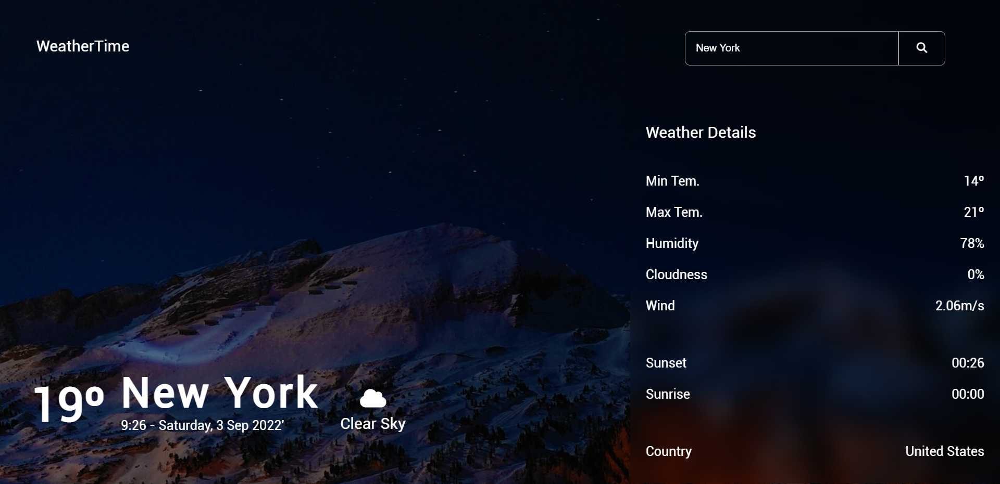
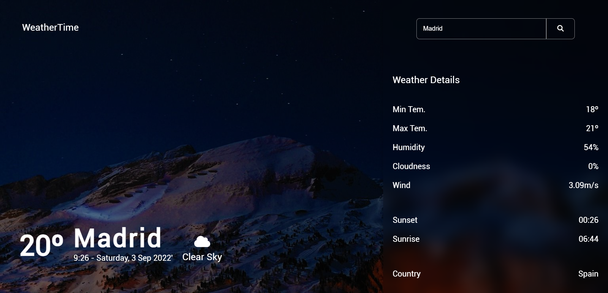

<h1 align="center">
   :cloud: <a href="#"> Wheater Forecast </a>
</h1>

  

  
  
  
    
   
    

<h4 align="center"> 
	 Status: Finished
</h4>

 <a href="#about">About</a> •
 <a href="#features">Features</a> •
 <a href="#layout">Layout</a> • 
 <a href="#tech-stack">Tech Stack</a> •  
 <a href="#author">Author</a> • 

## About

:cloud: Weather Forecast - This type of website is used to store a programmer's projects, as well as their skills and ways of communication, helping to demonstrate their competencies regarding the technologies they know.

---

## Features

- [x] Search City
- [x] CSS Flexbox
- [ ] Responsive Design
- [x] Consume API (OpenWeather)

---

## Layout

  

  

## Tech Stack

The following tools were used in the construction of the project:

- [JS](https://developer.mozilla.org/en-US/docs/Web/JavaScript)
- [CSS3](https://developer.mozilla.org/en-US/docs/Web/CSS)
- [HTML5](https://developer.mozilla.org/en-US/docs/Web/HTML)

#### **Utilitários**

-   Fonts:  **[Roboto](https://fonts.google.com/specimen/Roboto?query=Roboto)**
-   Icons:  **[Font Awesome](https://fontawesome.com/)**
-   Editor:  **[Visual Studio Code](https://code.visualstudio.com/)**
-   APIs: **[OpenWeatherAPI](https://openweathermap.org/current)** -> **[GeocodingAPI](https://openweathermap.org/api/geocoding-api)**, **[REST Countries](https://restcountries.com/#rest-countries)**

---

## How to contribute

1. Fork the project.
2. Create a new branch with your changes: `git checkout -b my-feature`
3. Save your changes and create a commit message telling you what you did: `git commit -m" feature: My new feature "`
4. Submit your changes: `git push origin my-feature`

---

## Author

    <a href="https://github.com/VicTor8g">
    

---

## License

This project is under the license [MIT](./LICENSE).